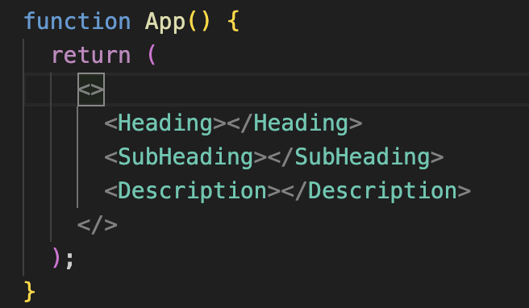
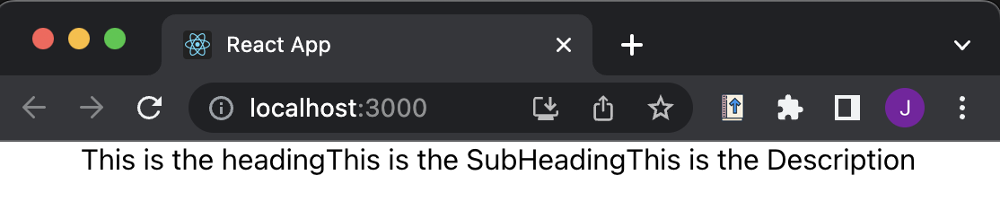
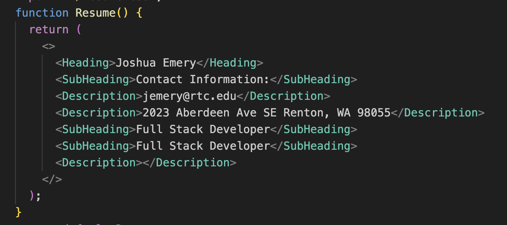
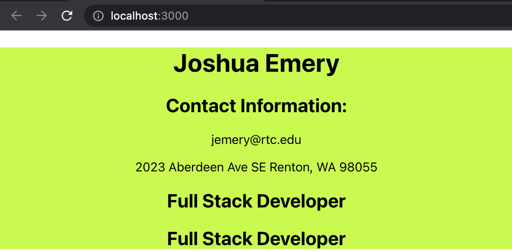
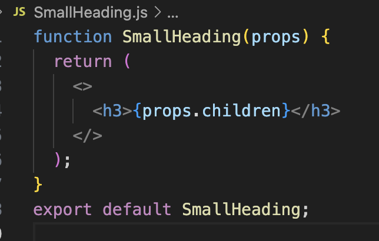
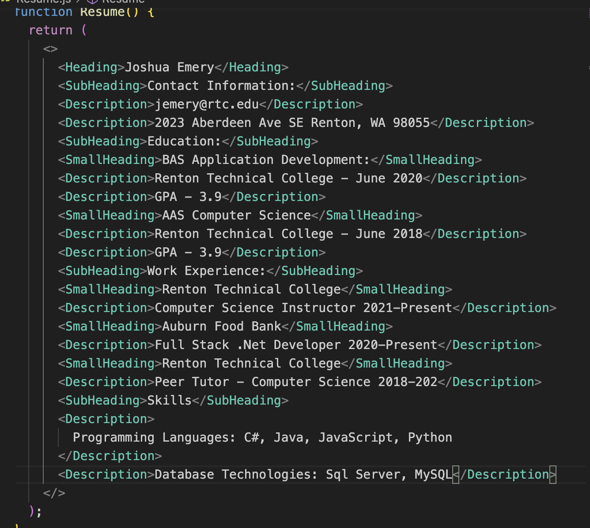
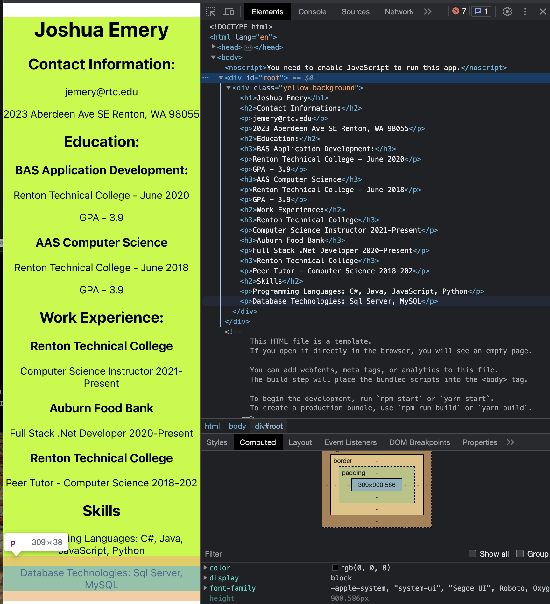

# PE01 - Resume

## Input

For this assignment we were given an example resume as an input and asked to create a react application displaying a similar resume.

## Process

In this assignment I used create-react-app to generated a new react application. For displaying the resume I used individual react components for each type of element used by the resume. Each element uses the children prop to receive data from the parent element. The following componenets were created.

1. Heading - H1 based component
2. SubHeading - H2 based component
3. SmallHeading - H3 based component
4. Description - P based component

-- Initial Setup:

-- Components Working

-- Adding More

-- Output

-- Small Heading

-- Resume

## Output

The output final output is displayed below:

